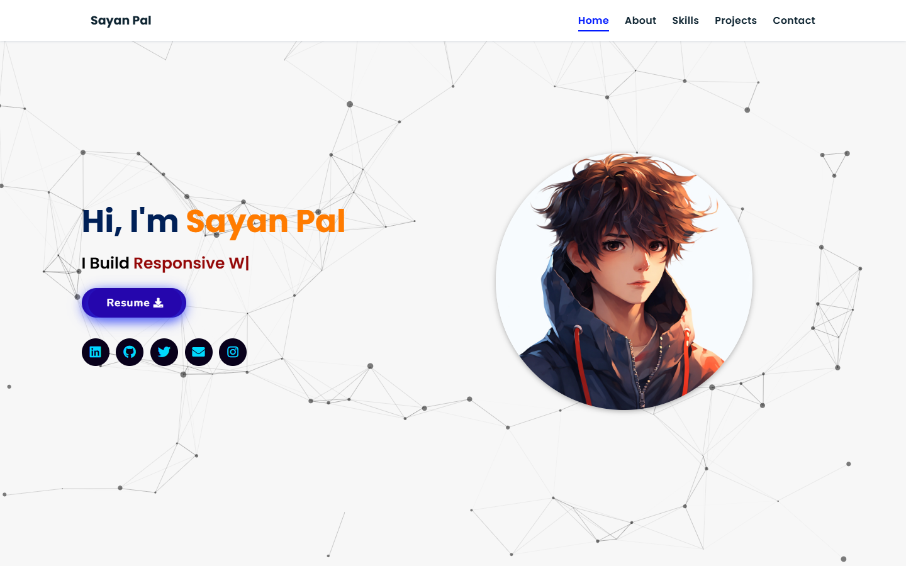
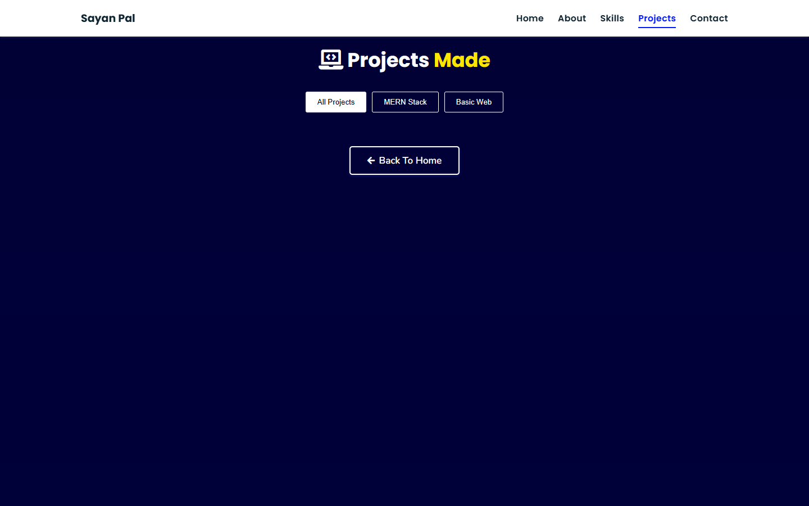
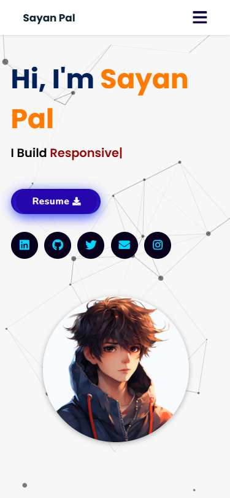
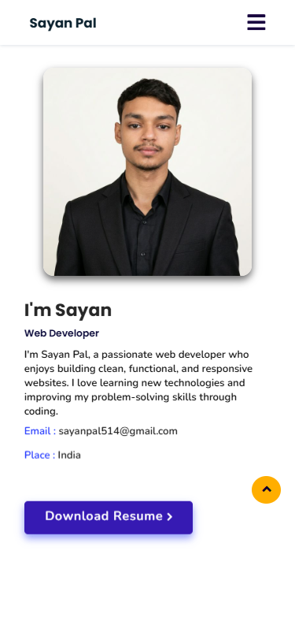
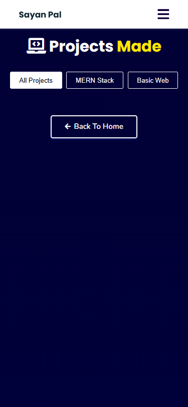

<div align="center">
  
  <h1>Sayan Pal | Personal Portfolio</h1>
  <p>A clean, responsive, and dynamic personal portfolio website to showcase my skills, experience, and projects.</p>

  <a href="https://sayanpal.pages.dev/" target="_blank">
    
  </a>
</div>

<hr/>

## 🎯 Features
- **Fully Responsive Design**: Looks perfect on desktops, tablets, and mobile devices.
- **Dynamic Projects Showcase**: Fetches and renders projects directly from JSON configuration.
- **Interactive UI/UX**: Includes Particle.js backgrounds, Typed.js typing effects, and Vanilla-Tilt.js card animations.
- **Filterable Portfolio**: Easily sort projects by technology (MERN, Basic Web, etc).
- **Smooth Animations**: Reveal effects on scroll via ScrollReveal.js.
- **Contact Form**: Direct email delivery using EmailJS.

## 💻 Tech Stack

<div align="center">
  <a href="https://developer.mozilla.org/en-US/docs/Web/HTML"></a>
  <a href="https://developer.mozilla.org/en-US/docs/Web/CSS"></a>
  <a href="https://developer.mozilla.org/en-US/docs/Web/JavaScript"></a>
  <a href="https://jquery.com/"></a>
  <a href="https://tailwindcss.com/"></a>
</div>

<br/>

## 📸 Screenshots

To populate these images, drop your screenshots into the `assets/images/screenshots/` folder matching the filenames below!

### 💻 Web View
<div align="center">
  <!-- Ensure you take a screenshot of your hero section and call it web-home.png -->
  
  <br/><br/>
  <!-- Ensure you take a screenshot of your projects section and call it web-projects.png -->
  
</div>

### 📱 Mobile View
<div align="center">
  <!-- Ensure you take a mobile screenshot of your hero section and call it mobile-home.png -->
  
  &nbsp; &nbsp; &nbsp;
  <!-- Ensure you take a mobile screenshot of your about section and call it mobile-about.png -->
  
  &nbsp; &nbsp; &nbsp;
  <!-- Ensure you take a mobile screenshot of your projects list and call it mobile-projects.png -->
  
</div>

<hr/>

## 🚀 Getting Started

To run this project locally, simply follow these steps:

1. **Clone the repository:**
   ```bash
   git clone https://github.com/sayanpal514-hue/Portfolio-Website-main.git
   ```

2. **Navigate to the directory:**
   ```bash
   cd Portfolio-Website-main
   ```

3. **Run the HTML file:**  
    Simply open the `index.html` file in your preferred web browser, OR start a quick local server using VS Code's **Live Server** extension.

4. **Updating skills and projects:**
    Modify the contents of `skills.json` and `projects/projects.json` to dynamically update the grids throughout the portfolio.

## 📬 Contact me

Feel free to connect with me exploring exciting opportunities! Let's build something beautiful together.

<div align="center">
  <a href="https://www.linkedin.com/in/sayan-pal-8092a8330"></a>
  <a href="https://github.com/sayanpal514-hue"></a>
  <a href="https://twitter.com/imVKohli970"></a>
  <a href="https://www.instagram.com/ig_sayan18/"></a>
</div>

<p align="center">
  <br/>
  <b>Made with ☕ by Sayan Pal</b>
</p>
